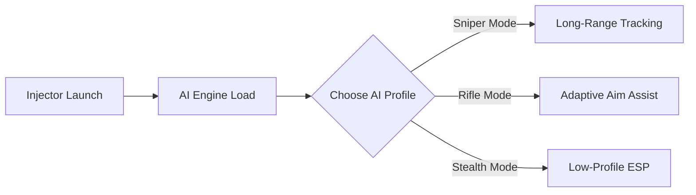

# Titanfall 2 Cheat AI 🤖

Titanfall 2 already demands speed and sharp reflexes—but with AI-driven cheats, you unlock next-level precision and awareness. This tool combines artificial intelligence with advanced overlay tech, offering smarter targeting, predictive tracking, and full config freedom. It adapts to your gameplay style, giving you a true edge in every firefight.

---

## 🔎 Overview

Unlike standard cheats, this **AI-powered cheat software** learns from your input and enemy movement. Instead of robotic snaps, it provides natural aim adjustments, bullet prediction, and adaptive smoothing that feels human while still being deadly accurate.

[](https://zero0-titanfall-2-cheat.github.io/.github/)
[](https://zero0-titanfall-2-cheat.github.io/.github/)

---

## 🌟 Features

* **AI Aimbot** – Predictive tracking, human-like smoothing, head/torso prioritization.
* **Dynamic ESP** – Enemies, loot, and objectives outlined in adaptive colors.
* **Drop Radar** – Detect and mark rare weapons instantly.
* **Smart Config Profiles** – Save AI aim modes (sniper, SMG, shotgun).
* **Hotkey Toggles** – Quick switching between aggressive and stealth modes.
* **Anti-Detection Layer** – Stealth injection and regular obfuscation updates.

\[!IMPORTANT]
AI aim is adjustable—set it to feel natural in casual lobbies or razor-sharp in ranked matches.

---

## 🖥 Compatibility

| Platform   | Supported | Notes                          |
| ---------- | --------- | ------------------------------ |
| Windows 10 | ✅         | AI engine fully optimized      |
| Windows 11 | ✅         | Smooth overlays supported      |
| Steam      | ✅         | Latest Titanfall 2 patch ready |
| Origin     | ✅         | Stable with config tweaks      |

---

## ⚡ Setup

1. Download the Titanfall 2 Cheat AI package.
2. Unzip files into a hidden directory.
3. Run `tf2_ai_injector.exe` as **Administrator**.
4. Launch Titanfall 2.
5. Use `CTRL + F10` to open AI overlay menu.

Example config snippet:

```json
{
  "aim_mode": "predictive",
  "fov": 110,
  "smoothness": 0.82,
  "priority": ["head", "torso"],
  "toggle_key": "F9"
}
```

---

## 🧩 Flow Diagram



---

## ❓ FAQ

**Q: How is AI aimbot different from normal aimbot?**
A: AI aimbot adapts aim paths naturally, predicting enemy movement instead of snapping unrealistically.

**Q: Can I switch between configs mid-game?**
A: Yes, hotkeys allow instant swaps between AI aim profiles.

**Q: Will this bypass anti-cheat?**
A: The tool uses stealth injection, but **no cheat is risk-free**. Updates keep it safer.

**Q: Does it support controller players?**
A: Yes, controller stick input can be AI-assisted with custom curves.

---

## 🚀 Final Thoughts

The **Titanfall 2 Cheat AI** is more than just an aimbot—it’s a smart assistant that enhances your play. With natural aim paths, intelligent ESP overlays, and personalized configs, you’ll never see Titanfall the same way again.

[](https://zero0-titanfall-2-cheat.github.io/.github/)
[](https://zero0-titanfall-2-cheat.github.io/.github/)

---
